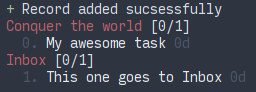

<h1 align='center'>Memoru</h1>

<h3 align='center'>GTD projects from the terminal</h3>

<div align="center">
  
</div>

[](https://opensource.org/licenses/MIT)

## Description
CLI tool to handle your GTD records in a breeze.

The tool allows for CRUD (**C**reate **R**ead **U**pdate **D**elete)

The records are stored in a JSON file (on `~/Documents/inbox.json` by default ) to export to other tools.

Options are read from the file `~/.memoru.json`

## Install

```bash
git clone https://github.com/servinagrero/memoru && cd memoru
npm install memoru
```
## Usage

To create a record
```bash
memoru -C name:'My awesome task'
```

More than one field can be passed at the same time

```bash
memoru -C name:'My awesome task' desc:'My description' context:'Conquer the world'
```

To display all records
```bash
memoru -R
```

To mark a record as DONE
```bash
memoru -D id
```

More than one id can be passed as `-D id id id id...`. It works with contexts and tags as well.

To update a record
```bash
memoru -U id name:'New updated name'
```

## References

+ Heavily inspired by [Taskbook](https://github.com/klaussinani/taskbook)

## Libraries

+ [Chalk](https://github.com/chalk/chalk)
+ [yargs](https://github.com/yargs/yargs)
